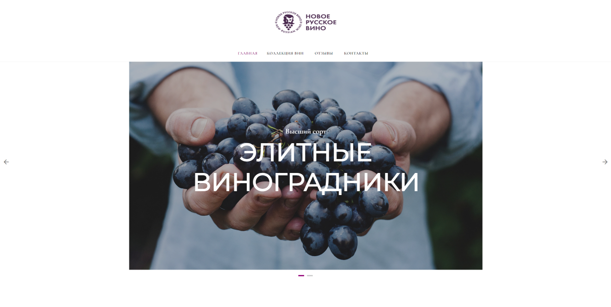

# Новое русское вино

Сайт магазина авторского вина "Новое русское вино".

## Как установить
Скачайте репозиторий и установите Python пакеты из `requirements.txt`:
```bash
git clone https://github.com/AlexRikka/devman_wine_website.git
cd devman_wine_website
pip install -r requirements.txt
```
Укажите путь до excel файла с данными о продукции, отображаемой на сайте. Это можно сделать двумя способами:
 - Создать в папке с проектом файл `.env` и добавить путь к файлу в переменную окружения `DATA_PATH`.
 - Прописать путь до файла в качестве аргумента в командной строке при запуске скрипта `main.py`.

Пример структуры файла представлен в [wine.xlsx](wine.xlsx)

Запустите сайт командой:
```
python main.py data\wine.xlsx
```
Перейдите на сайт по адресу [http://127.0.0.1:8000](http://127.0.0.1:8000).


## Пример главной страницы сайта



## Цели проекта

Код написан в учебных целях — это урок в курсе по Python и веб-разработке на сайте [Devman](https://dvmn.org).
